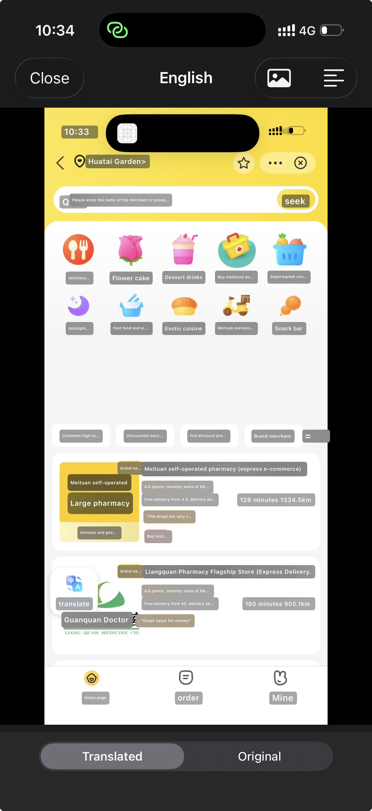

<div align="center">

# Translate Screen

**Translate text anywhere on your iPhone—without losing the original screen layout.**

[](https://www.swift.org/)
[](https://developer.apple.com/ios/)
[](https://developer.apple.com/xcode/swiftui/)
[](LICENSE)
[](https://github.com/0xffvirus/translate-screen/actions/workflows/release-ipa.yml)
[](https://developer.apple.com/documentation/)

See foreign text → press the Action Button → see the translated screen.

</div>

## Preview

<p align="center">
  
</p>

<p align="center">
  <sub>Translated text remains aligned with the original interface while preserving the surrounding visual context.</sub>
</p>

## Overview

Translate Screen is a native iPhone utility that recognizes text in a screenshot, translates it on-device, and places the translation over the original text in approximately the same location.

Instead of reducing a screen to a plain list of sentences, the app preserves the visual context of menus, websites, maps, messages, social media, and other interfaces. It is designed around a fast Action Button workflow, with manual screenshot import available when needed.

> [!IMPORTANT]
> Translate Screen is an early-stage open-source project. APIs, storage formats, and UI behavior may change as the project evolves.

## Features

- **Layout-aware translation** — Uses Vision bounding boxes to position translated text over the original screenshot.
- **Action Button workflow** — Receives the output of Shortcuts' **Take Screenshot** action and opens the translated result.
- **On-device processing** — Text recognition and translation use Apple's Vision and Translation frameworks.
- **Automatic language detection** — Detects the source language or allows explicit language selection.
- **Multiple languages** — Supports English, Arabic, Chinese, Japanese, Korean, Spanish, French, German, Italian, Portuguese, and Russian.
- **First-class Arabic support** — Right-to-left layout, alignment, and mixed text handling.
- **Interactive overlays** — Tap a translated region to inspect and copy the original or translated text.
- **Original comparison** — Switch between the original and translated screenshot at any time.
- **Press-and-hold reveal** — Temporarily reveal the original text underneath an overlay.
- **Full-text mode** — Read and copy all recognized content outside the image layout.
- **Manual import** — Choose an existing screenshot from Photos.
- **Optional history** — Save up to 20 recent translations locally, with history disabled by default.
- **Appearance controls** — Choose Natural, Readable, or Minimal overlays.
- **Native design** — Built with SwiftUI and supports Light and Dark Mode.

## How It Works

```text
Take Screenshot
      │
      ▼
Translate Screenshot
      │
      ▼
Vision text recognition
      │
      ▼
On-device batch translation
      │
      ▼
Layout-preserving overlays
```

1. Shortcuts captures the current screen.
2. The `TranslateScreenshotIntent` receives the screenshot as an `IntentFile`.
3. Vision recognizes text and returns normalized bounding boxes.
4. Apple's Translation framework translates the recognized blocks in a batch.
5. SwiftUI renders the translated blocks over the original image using their detected positions.

## Action Button Setup

Run Translate Screen once after installing it, then create a shortcut with these two actions:

1. Add **Take Screenshot**.
2. Add **Translate Screenshot** from Translate Screen directly below it.
3. Confirm that the Screenshot output from the first action is connected to the Screenshot input of the second action.
4. Name the shortcut `Translate Screen`.
5. Open **Settings → Action Button → Shortcut**.
6. Select `Translate Screen`.

The resulting workflow is:

```text
Take Screenshot → Translate Screenshot → Open translated result
```

No photo picker, conditional action, or separate Open action is required. iOS requires the system **Take Screenshot** action to be added during this one-time setup; third-party apps cannot silently capture the contents of other apps.

Devices without an Action Button can run the same shortcut from Shortcuts, Siri, a Home Screen shortcut, or another supported automation trigger.

## Requirements

- Xcode 26.6 or later
- iOS 26.5 or later
- A physical iPhone is recommended for Translation and Action Button testing
- An Apple Development team for installing on a physical device
- Downloaded Apple translation language models for the selected language pair

The current deployment target follows the project configuration. Contributors are welcome to help evaluate a lower deployment target while preserving the existing functionality.

## Getting Started

1. Clone or fork the repository.
2. Open `ScreenTranslate.xcodeproj` in Xcode.
3. Select the **ScreenTranslate** target.
4. Choose your development team under **Signing & Capabilities**.
5. Select a physical iPhone or simulator.
6. Build and run.

You can also verify the project from the command line:

```bash
xcodebuild \
  -project ScreenTranslate.xcodeproj \
  -scheme ScreenTranslate \
  -sdk iphoneos \
  -configuration Debug \
  CODE_SIGNING_ALLOWED=NO \
  build
```

The first translation may ask permission to download the required Apple language model.

## IPA Releases

GitHub Actions builds an unsigned IPA for every version tag and attaches it to the corresponding GitHub Release. Unsigned IPAs cannot be installed directly on a standard iPhone; users must sign them with their own Apple ID or certificate using a compatible sideloading tool.

Each release includes:

- `TranslateScreen-<version>-unsigned.ipa`
- `TranslateScreen-<version>-unsigned.ipa.sha256`

To publish a release:

```bash
git tag v1.0.0
git push origin v1.0.0
```

The tag version becomes the app's `CFBundleShortVersionString`. GitHub automatically generates release notes and uploads the IPA after a successful build.

To test IPA creation without publishing a release, open **Actions → Build IPA → Run workflow**. The IPA will be available under the workflow run's **Artifacts** section.

> [!WARNING]
> Never commit Apple signing certificates, private keys, provisioning profiles, or App Store Connect credentials. A future signed distribution workflow should store them as encrypted GitHub Actions secrets.

## Project Structure

| File | Responsibility |
| --- | --- |
| `ScreenTranslateApp.swift` | App entry point and shared dependency setup |
| `ContentView.swift` | Home screen, screenshot import, processing, and translation result UI |
| `OnboardingView.swift` | First-run onboarding and Action Button setup guide |
| `TranslateScreenshotIntent.swift` | App Intent used by Shortcuts and the Action Button workflow |
| `TranslationEngine.swift` | Vision text recognition and bounding-box extraction |
| `AppState.swift` | Translation workflow and UI state coordination |
| `Models.swift` | Languages, recognized blocks, settings, and history models |
| `HistoryView.swift` | Optional local translation history |
| `SettingsView.swift` | Languages, appearance, privacy, and shortcut settings |

## Privacy

Privacy is a core design constraint:

- Screenshots are recognized and translated using Apple frameworks on the device.
- Translate Screen does not include analytics, advertising SDKs, or its own screenshot-upload service.
- Translation history is disabled by default.
- When history is off, the app does not intentionally persist completed translations.
- When history is enabled, screenshots and text are stored in the app's private local container.
- Saved history can be removed from the History or Settings screen.

Review all privacy behavior before distributing a modified build, especially if adding analytics, cloud translation providers, crash reporting, or synchronization.

## Known Limitations

- Overlay backgrounds are adaptive materials; they do not reconstruct pixels hidden by the original text.
- Vision may split or combine text differently depending on typography and screen complexity.
- Translation quality and supported language pairs depend on Apple's installed translation models.
- Highly stylized, curved, handwritten, very small, or low-contrast text may not be recognized accurately.
- The system **Take Screenshot** action must be added to the shortcut once by the user.
- A native Share Extension is not yet included.

## Roadmap

- [ ] Downloadable, preconfigured Apple Shortcut
- [ ] Share Sheet extension
- [ ] Smarter paragraph and interface-element grouping
- [ ] Improved background sampling and overlay blending
- [ ] More supported languages
- [ ] App localization
- [ ] OCR and layout regression tests
- [ ] Accessibility audit
- [ ] Performance profiling on older supported devices

## Contributing

Contributions are welcome. Bug fixes, accessibility improvements, translations, documentation, tests, and focused feature proposals are especially valuable.

1. Search existing issues before opening a new one.
2. Fork the repository and create a focused branch.
3. Keep changes scoped and follow the existing SwiftUI style.
4. Build the project and test the affected workflow.
5. Open a pull request explaining the problem, approach, and testing performed.

For substantial behavior or architecture changes, open a discussion or issue before investing in a large implementation.

Please avoid committing:

- Personal signing identifiers or provisioning profiles
- User-specific Xcode data
- Screenshots containing private information
- Proprietary translation services or credentials
- Generated build output and Derived Data

## Security

Do not report vulnerabilities involving screenshot exposure, local data access, unsafe file handling, or privacy leaks in a public issue. Use the repository owner's private security reporting channel once it is configured.

## License

Translate Screen is licensed under the [Apache License 2.0](LICENSE). You may use, modify, and distribute the project, including in commercial applications, subject to the license terms.

Unless explicitly stated otherwise, contributions submitted to this repository are licensed under the same terms.

---

<div align="center">

Built with SwiftUI, Vision, App Intents, and Apple Translation.

</div>
